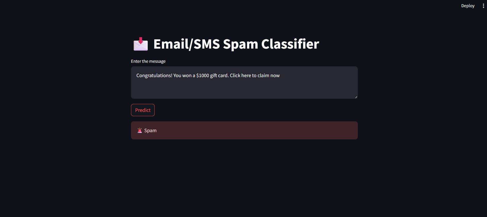

# 📩 Spam Classifier

A simple and efficient **Email/SMS Spam Classifier** built using **Python, Streamlit, and Machine Learning**. This app can predict whether a message is **spam** or **not spam** (ham) in real-time.  

---

## 🚀 Features

- Predicts **spam** or **ham** for any text input.
- Uses **NLTK** for text preprocessing (tokenization, stopwords removal, stemming).
- **TF-IDF vectorizer** for text feature extraction.
- **Multinomial Naive Bayes** for classification.
- Interactive web app built with **Streamlit**.
- Easy to deploy and use online.

---

## 🛠️ Technologies Used

- Python
- Streamlit
- scikit-learn
- NLTK (Natural Language Toolkit)
- Pickle (for saving model and vectorizer)

---

## 💡 How It Works

1. **User Input:** Enter the text message in the app.
2. **Text Preprocessing:** Lowercasing, tokenization, stopwords removal, and stemming.
3. **Vectorization:** Transform the cleaned text using TF-IDF vectorizer.
4. **Prediction:** The model predicts whether the message is spam or not.
5. **Output:** Shows **🚨 Spam** or **✅ Not Spam** on the app.

---

## 🖥️ Demo

  

## 📈 Future Improvements
- Add support for multiple languages.
- Train with a larger dataset for better accuracy.
- Include real-time email integration.
- Add confidence score for predictions.
-  Deploy the app on cloud platforms like Streamlit Cloud, Heroku, or AWS for wider accessibility.

## 📧 Contact
Made with ❤️ by Anand Mehto
Feel free to connect on linkedin.com/in/anandmehto

